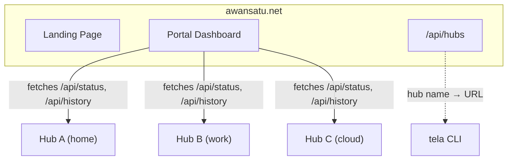

# Awan Satu

Multi-hub aggregation portal for [Tela](https://github.com/paulmooreparks/tela).

Awan Satu is the platform layer that sits above one or more Tela hubs, providing:

- **Landing page** at `awansatu.net/` — product information and download links
- **Portal** at `awansatu.net/portal/` — multi-hub dashboard aggregating machines, services, and sessions across all registered hubs
- **Hub API** at `awansatu.net/api/hubs` — hub directory for CLI hub name resolution
- **SSO & RBAC** — centralized authentication and access control (planned)
- **Federation** — any Tela hub exposing the standard API can be registered

## Architecture



## CLI Integration

The Tela CLI resolves short hub names via the portal:

```bash
tela login https://awansatu.net       # authenticate once
tela machines -hub owlsnest            # hub name resolved via /api/hubs
tela connect -hub owlsnest -machine barn
tela logout                            # remove stored credentials
```

## API

### `GET /api/hubs`

Returns the hub directory. Requires `Authorization: Bearer <token>` when `TELA_API_TOKEN` is set on the server; open mode otherwise.

```json
{
  "hubs": [
    { "name": "owlsnest", "url": "https://owlsnest-hub.parkscomputing.com" }
  ]
}
```

## Development

```bash
docker compose up --build
```

The portal serves on port 3000 by default.

## License

See [Tela](https://github.com/paulmooreparks/tela) for license information.
