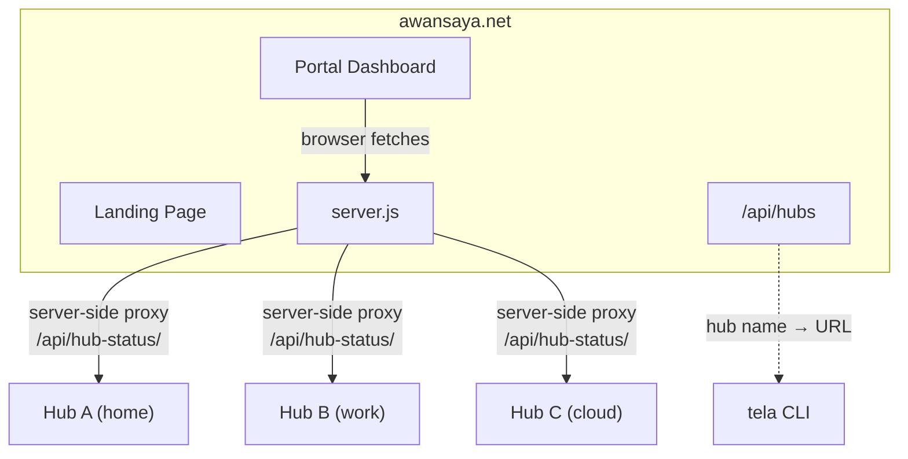

# Awan Saya

Multi-hub aggregation portal for [Tela](https://github.com/paulmooreparks/tela).

Awan Saya is the platform layer that sits above one or more Tela hubs, providing:

- **Landing page** at `awansaya.net/` — product information and download links
- **Portal** at `awansaya.net/portal/` — multi-hub dashboard aggregating machines, services, and sessions across all registered hubs
- **Hub API** at `awansaya.net/api/hubs` — hub directory for CLI hub name resolution
- **SSO & RBAC** — centralized authentication and access control (planned)
- **Federation** — any Tela hub exposing the standard API can be registered

## Architecture



## Networking & reachability

The Portal can only show hubs that the user’s browser can reach.

At a minimum:

- Each **Hub** must be reachable from the user’s browser over **HTTPS/WebSockets**.
- Each Hub must allow cross-origin reads of its status endpoints (`/api/status` and `/api/history`). Tela’s current hub implementation sets permissive CORS headers for these endpoints.

Common requirements:

| Component | Needs inbound | Needs outbound | Notes |
|----------|--------------|---------------|------|
| **Hub** (`hub.js`) | TCP 443 (recommended) for HTTPS + WebSockets | none special | Optional: UDP 41820 for UDP relay. Must expose `/api/status` + `/api/history` for portal cards/metrics. |
| **Portal (static site)** | TCP 80/443 to serve the portal | n/a | Browser then directly fetches each Hub’s API. |
| **Portal server** (`server.js`) | TCP 80/443 to serve `/api/hubs` | n/a | Directory may require `Authorization: Bearer <token>` when `AWANSATU_API_TOKEN` is set. |

See also:

- `howto/networking.md`
- `howto/portal.md`

## CLI Integration

The Tela CLI resolves short hub names via the portal:

```bash
tela login https://awansaya.net       # authenticate once
tela machines -hub owlsnest            # hub name resolved via /api/hubs
tela connect -hub owlsnest -machine barn
tela logout                            # remove stored credentials
```

## API

### `GET /api/hubs`

Returns the hub directory (viewer tokens are stripped from the response). Requires `Authorization: Bearer <token>` when `AWANSATU_API_TOKEN` is set on the server; open mode otherwise.

```json
{
  "hubs": [
    { "name": "owlsnest", "url": "https://owlsnest-hub.parkscomputing.com" }
  ]
}
```

### `POST /api/hubs`

Add a hub to the directory. Requires `Authorization: Bearer <token>` when `AWANSATU_API_TOKEN` is set.

```json
{ "name": "owlsnest", "url": "https://owlsnest-hub.parkscomputing.com", "viewerToken": "<token>" }
```

### `DELETE /api/hubs/:name`

Remove a hub from the directory. Requires `Authorization: Bearer <token>` when `AWANSATU_API_TOKEN` is set.

### `GET /api/hub-status/:name`

Server-side proxy — fetches `/api/status` from the named hub using the stored viewer token and returns the result to the browser.

### `GET /api/hub-history/:name`

Server-side proxy — fetches `/api/history` from the named hub using the stored viewer token and returns the result to the browser.

## Configuration

### `www/portal/config.json`

The portal stores its hub directory in [www/portal/config.json](www/portal/config.json):

```json
{
  "hubs": [
    { "name": "owlsnest", "url": "https://tela.awansaya.net", "viewerToken": "<hub-viewer-token>" }
  ]
}
```

- `name` is the short hub name users pass to `tela ... -hub <name>`.
- `url` must be reachable from the portal **server** (the server proxies hub status; the browser never contacts hubs directly).
- `viewerToken` is a Tela hub token with the `viewer` role. The portal server uses it to authenticate when proxying `/api/status` and `/api/history` from the hub. This token is never exposed to the browser.
- The Tela CLI converts `https://` → `wss://` (and `http://` → `ws://`) when resolving hub names via the portal.

To protect `/api/hubs`, set `AWANSATU_API_TOKEN` on the portal server and use `Authorization: Bearer <token>` from the CLI (`tela login`).

## Development

```bash
docker compose up --build
```

The portal serves on port 3000 by default.

## License

See [Tela](https://github.com/paulmooreparks/tela) for license information.
