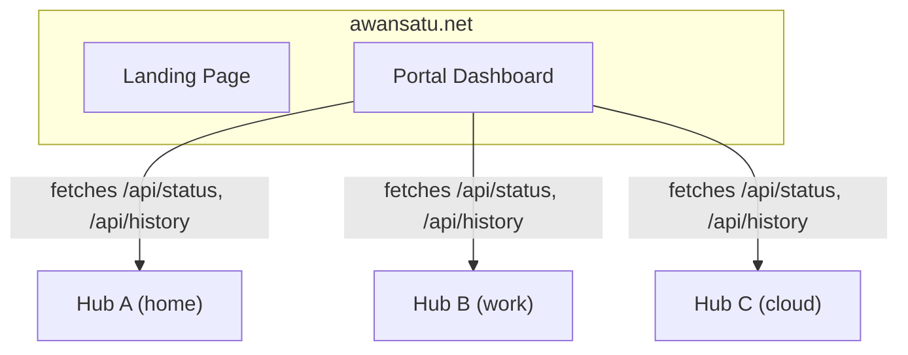

# Awan Satu

Multi-hub aggregation portal for [Tela](https://github.com/paulmooreparks/tela).

Awan Satu is the platform layer that sits above one or more Tela hubs, providing:

- **Landing page** at `awansatu.net/` — product information and download links
- **Portal** at `awansatu.net/portal/` — multi-hub dashboard aggregating machines, services, and sessions across all registered hubs
- **SSO & RBAC** — centralized authentication and access control (planned)
- **Federation** — any Tela hub exposing the standard API can be registered

## Architecture



## Development

```bash
docker compose up --build
```

The portal serves on port 3000 by default.

## License

See [Tela](https://github.com/paulmooreparks/tela) for license information.
