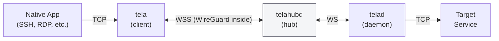
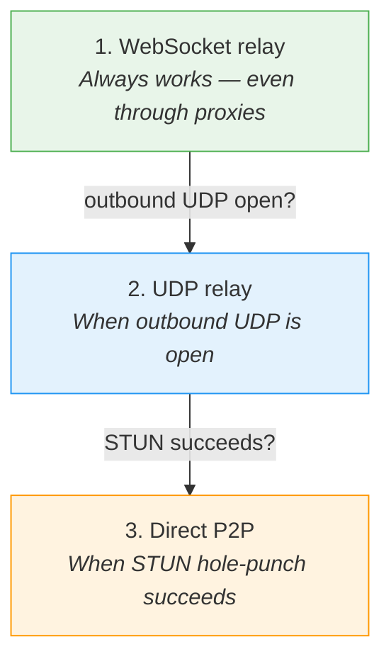
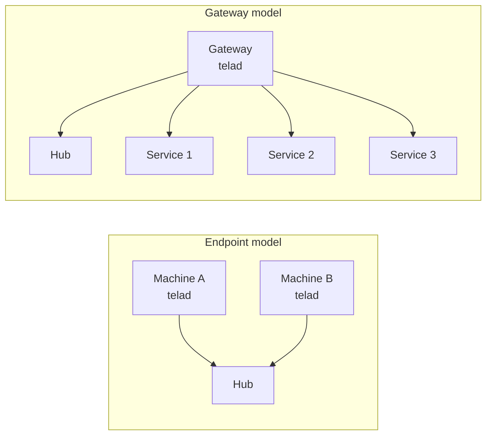
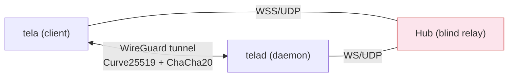
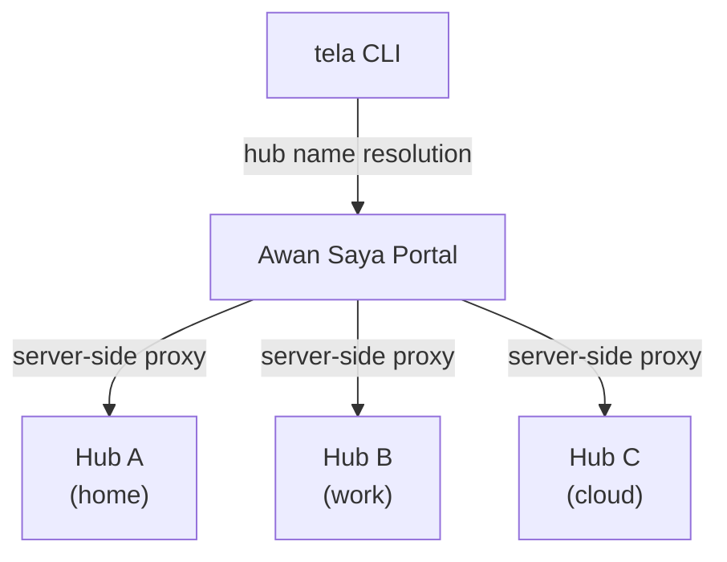
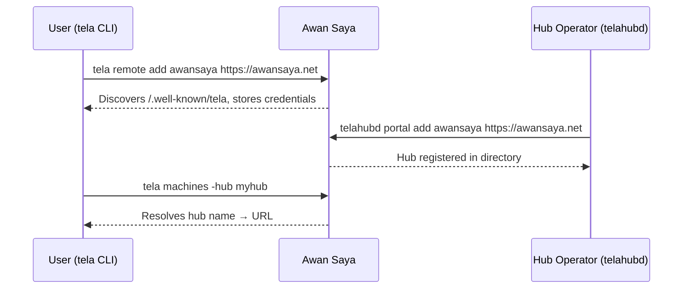
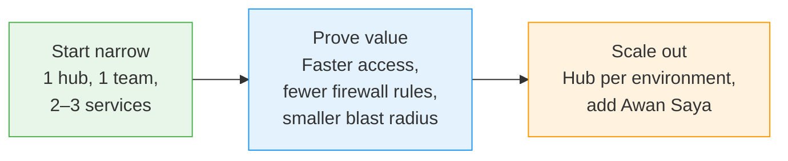

<!--
Export in VS Code:
1) Install "Marp for VS Code"
2) Open this file
3) Run "Marp: Export slide deck..."

Mermaid diagrams render in Marp for VS Code (v2.8+) and marp-cli (v4+).
-->

# Tela + Awan Saya
## Secure remote access without VPN friction

**Tela** = connectivity fabric (Filipino for *fabric*)
**Awan Saya** = platform layer (Malay for *my cloud*)

---

# Executive summary

- IT teams need access to systems that are **private, segmented, and locked down**
- Traditional approaches often mean **too much network access** or **too much operational overhead**
- **Tela** provides narrow access to specific TCP services via encrypted tunnels
- **Awan Saya** adds multi-hub visibility, discovery, access control, and onboarding

**Bottom line:** simpler remote access, smaller blast radius, less VPN friction.

---

# The problem

- Teams are distributed
- Infrastructure is behind NAT and firewalls
- Corporate endpoints often block admin installs, drivers, and TUN devices
- Security teams want **least privilege**, not flat network access

**Result:** remote access is slow to roll out and hard to control.

---

# Why existing approaches fall short

- **VPNs / mesh VPNs**
  Often require admin rights, drivers, or broad network trust

- **Bastions / jump hosts**
  Add infrastructure and create choke points

- **HTTP tunnels**
  Great for web apps, awkward for raw TCP services

- **Large zero-trust platforms**
  Powerful, but often heavy and expensive for small or mid-sized teams

---

# Tela in one slide

**Tela gives users secure access to TCP services without requiring a traditional VPN.**

- End-to-end encrypted userspace WireGuard tunnel
- Hub relays **ciphertext only** — it never sees plaintext
- Client and daemon are both **outbound-only**
- No admin privileges or TUN devices required

---

# Why Tela is different

1. **Zero-install, no-admin client** — pure userspace, no drivers
2. **Protocol-agnostic TCP tunneling** — SSH, RDP, HTTP, databases, anything TCP
3. **Outbound-only connectivity** — no inbound ports on either end
4. **End-to-end encryption through a blind relay** — the hub sees only ciphertext
5. **Automatic transport upgrade** — WebSocket → UDP relay → direct P2P
6. **Single-binary, lightweight deployment** — one Go binary per component

---

# Transport upgrade cascade

After the initial WebSocket connection, Tela automatically negotiates faster transports:

Each tier falls through automatically on failure. No user action required.
The hub always relays opaque WireGuard ciphertext regardless of transport.

---

# Where it fits best

| Use case | Why Tela works |
|----------|---------------|
| **Developer access** to staging/production | No VPN rollout, narrow scope |
| **Bastion replacement** (SSH, RDP, DB) | Userspace, outbound-only |
| **MSP / IT support** into customer networks | Zero-install behind NAT |
| **IoT and edge** in networks you don't control | Single binary, no admin |
| **Training labs / classrooms** | No VPN provisioning overhead |

---

# Operating model

**Endpoint agent** — `telad` on each managed machine
**Gateway agent** — `telad` on one machine that can reach internal targets

Control surface stays small: expose only the specific service ports you want.

---

# Security view

| Property | Detail |
|----------|--------|
| **Encryption** | End-to-end WireGuard (hub never sees plaintext) |
| **Exposure** | Outbound-only from both ends |
| **Authentication** | Token-based RBAC: owner / admin / user / viewer |
| **Segmentation** | One hub per environment, site, or customer |
| **Auditability** | Hub exposes connection history and status APIs |

**Key takeaway:** less network exposure, tighter scope, easier review.

---

# Awan Saya — the platform layer

Tela is the engine. Awan Saya adds the platform features around it.

- Multi-hub dashboard and fleet visibility
- Hub directory and name resolution
- Personal API tokens for CLI authentication
- User management and access control
- Foundation for centralized RBAC and SSO

**Analogy:** Tela : Awan Saya :: git : GitHub

---

# Registration model

Two registration paths — users and hubs:

- **Users** run `tela remote add` to register with a portal
- **Hub operators** run `telahubd portal add` to list their hub in the directory
- Both use **personal API tokens** generated in the portal settings page

---

# What the platform changes

| Without Awan Saya | With Awan Saya |
|-------------------|----------------|
| Users need specific hub URLs | Users log in once, browse by name |
| Onboarding is manual | CLI auto-discovers hubs via remotes |
| Multi-hub visibility is fragmented | One dashboard shows fleet-wide status |
| Each hub is an island | Hubs register themselves in the directory |
| Token management is per-hub | Personal API tokens from a central portal |

---

# Adoption path

Tela works standalone from day one.
Add Awan Saya when multi-hub discovery and centralized visibility become useful.

---

# Recommended first pilot

Choose one:

1. **Developer access to staging**
2. **Production bastion replacement**
3. **MSP support into customer networks**

Pilot success metrics:

- Time to onboard a user
- Number of inbound firewall rules avoided
- Time to reach a target machine or service
- Auditability of who connected and when

---

# Next steps

1. Stand up a hub (`telahubd`)
2. Register one or two services via `telad`
3. Onboard a small user group with `tela connect`
4. Optionally register the hub with a portal (`telahubd portal add`)
5. Add Awan Saya when centralized visibility and hub discovery become useful

**Goal:** Move from ad hoc remote access
to a **repeatable connectivity fabric + platform model**.

